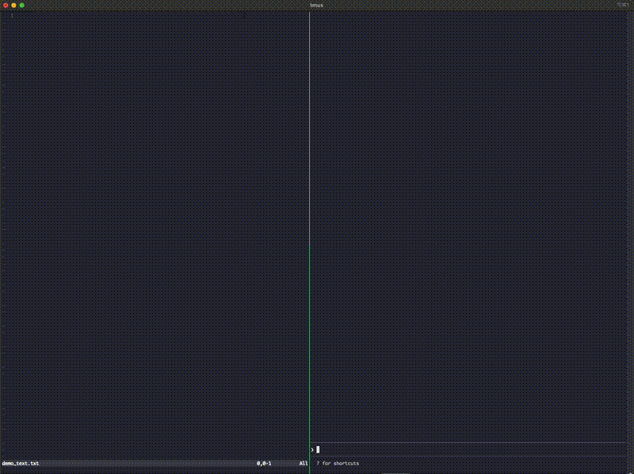

# nvim-bridge

Bidirectional bridge between [Claude Code](https://claude.ai/claude-code) and Neovim. Every file Claude edits automatically opens in your editor.



```
┌─────────────────┐                    ┌─────────────────┐
│   Claude Code   │ ── Edit file ───►  │     Neovim      │
│   (terminal 1)  │                    │   (terminal 2)  │
│                 │ ◄── Read buffer ── │                 │
└─────────────────┘                    └─────────────────┘
        │                                      ▲
        │         PostToolUse hook             │
        └──────── auto-opens file ─────────────┘
```

## Features

- **Auto-sync edits** - Files Claude edits instantly appear in Neovim
- **Read buffers** - Claude can see what you're working on
- **Navigate files** - Claude can open files at specific lines
- **Execute commands** - Run Vim/Lua commands from Claude

## Install

```bash
curl -fsSL https://raw.githubusercontent.com/yakschuss/nvim-bridge/main/install.sh | bash
```

Then restart Claude Code.

## Usage

Start Neovim with a socket (any unique name works):

```bash
nvim --listen /tmp/nvim-$USER.sock myfile.py
```

Or add an alias to your shell config:

```bash
alias vim='rm -f /tmp/nvim-$USER.sock 2>/dev/null; nvim --listen /tmp/nvim-$USER.sock'
```

The first nvim you open automatically becomes the "paired" instance. Claude's edits appear there.

### Multiple Neovim Instances

Open as many nvims as you want. Switch which one receives Claude's edits:

```vim
:ClaudePair     " Make THIS nvim receive Claude's edits
:ClaudeStatus   " Check if this nvim is paired
```

The plugin auto-pairs the first nvim you open. After that, use `:ClaudePair` to switch.

## What gets installed

| Location | Purpose |
|----------|---------|
| `~/.config/nvim-bridge/` | MCP server (Node.js) |
| `~/.local/share/nvim/site/plugin/nvim-bridge.lua` | Neovim plugin (`:ClaudePair`) |
| `~/.claude/hooks/push-to-nvim.sh` | Auto-push hook |
| `~/.claude/settings.json` | Hook configuration |
| `~/.claude.json` | MCP server registration |

## MCP Tools

The bridge exposes these tools to Claude:

| Tool | Description |
|------|-------------|
| `nvim_get_buffer` | Read current buffer content |
| `nvim_set_buffer` | Write to buffer |
| `nvim_get_context` | Get editor state (file, cursor, diagnostics) |
| `nvim_navigate` | Open file at line/column |
| `nvim_execute` | Run Vim command or Lua code |
| `nvim_status` | Check if Neovim is connected |

## Why nvim-bridge?

[claudecode.nvim](https://github.com/coder/claudecode.nvim) runs Claude *inside* Neovim as a split or floating window. It's a great project if you want an IDE-like experience where Neovim is the hub.

nvim-bridge takes a different approach: **Claude and Neovim stay in separate terminals, loosely coupled.**

```
┌─────────────────────────────────────────────────┐
│ tmux                                            │
│  ┌──────────────┐  ┌──────────────┐  ┌────────┐│
│  │    Neovim    │  │  Claude Code │  │  bash  ││
│  │              │  │              │  │        ││
│  │  (edits     ◄───  (edits      │  │ (tests,││
│  │   appear     │  │   files)     │  │  git,  ││
│  │   here)      │  │              │  │  etc)  ││
│  └──────────────┘  └──────────────┘  └────────┘│
└─────────────────────────────────────────────────┘
```

This is for people who live in tmux - jumping between panes, opening and closing them reflexively. You don't want Claude shoved inside your editor. You want them side by side, each in their own pane, doing their own thing.

| | **nvim-bridge** | **claudecode.nvim** |
|---|---|---|
| Where Claude runs | Its own terminal | Inside Neovim |
| Workflow | tmux panes | Neovim splits |
| Coupling | Loose - socket | Tight - WebSocket |
| Complexity | ~300 lines | Full IDE integration |
| Selection tracking | No (just ask Claude) | Yes |
| Diff review | No - file just opens | Native diff pane |

Both are valid. Pick the one that matches how you work.

## Requirements

- Node.js 18+
- Neovim 0.9+
- Claude Code CLI
- `jq` (for the hook)

## Uninstall

```bash
rm -rf ~/.config/nvim-bridge
rm ~/.claude/hooks/push-to-nvim.sh
rm ~/.local/share/nvim/site/plugin/nvim-bridge.lua
# Manually remove the hook from ~/.claude/settings.json
# Manually remove nvim-bridge from ~/.claude.json mcpServers
```

## License

MIT
